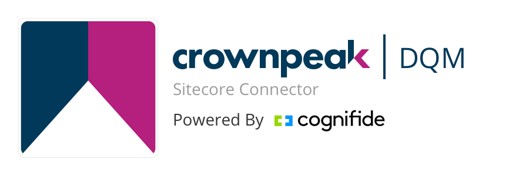

# Crownpeak DQM Sitecore Connector

Crownpeak DQM Sitecore Connector builds Digital Quality Management directly into your Sitecore publication workflow, closing the gap between content authoring and digital quality assurance. So your digital marketing team can test and optimize content without ever leaving the Sitecore environment.

Organizations with multiple websites, multiple channels and globally-distributed digital teams need control over the quality and consistency of every digital touchpoint. Otherwise, issues ranging from broken links to outdated content or SEO errors can go undetected, and become serious and costly -- or worse, compromise the integrity of your brand and put your organization at risk. 

Crownpeak DQM protects your brand and your organization by crawling your site and identifying issues based on a set of best practice checkpoints as well your own customizable list.

Learn more about the detailed features of the product and why the world’s top brands rely on the leading SaaS solution for digital governance, [Crownpeak DQM](https://www.crownpeak.com/products/digital-quality-management/).

The Crownpeak DQM Sitecore Connector has been developed by [Cognifide](http://www.cognifide.com/), a WPP digital technology consultancy. Cognifide is a Sitecore Platinum Implementation Partner and the creators of the Sitecore Experience Accelerator (SXA). 

## Requirements

* Sitecore XP 8.2
* Crownpeak DQM

## Installation

1. Download Sitecore Crownpeak Connector zip package.
2. Log in to Sitecore, go to Control Panel and run Install a package.
3. Upload the package and follow wizard steps to complete installation.
4. Obtain API key and website ID from Crownpeak.
5. Modify /App_Config/Include/Cognifide.Crownpeak.config file by entering your API key and website ID.

## Development

The connector consists of configuration, code and Sitecore items. Use Visual Studio 2017 IDE to modify connector code and configuration. Deploy your changes to Sitecore instance using publish feature in Visual Studio. Connector items can be synced between the repository and Sitecore instance using [Unicorn](https://github.com/kamsar/Unicorn).

Remember to regenerate Sitecore package after each iteration using the following steps:

1. Install [Sitecore PowerShell Extensions](https://marketplace.sitecore.net/en/Modules/Sitecore_PowerShell_console.aspx) module.
2. Run `CreatePackage.ps1` file in PowerhShell ISE.
3. Download created package and include it in your pull request.

## License

**Crownpeak DQM Sitecore Connector** is licensed under the [Apache License, Version 2.0 (the "License")](https://www.apache.org/licenses/LICENSE-2.0.txt)
